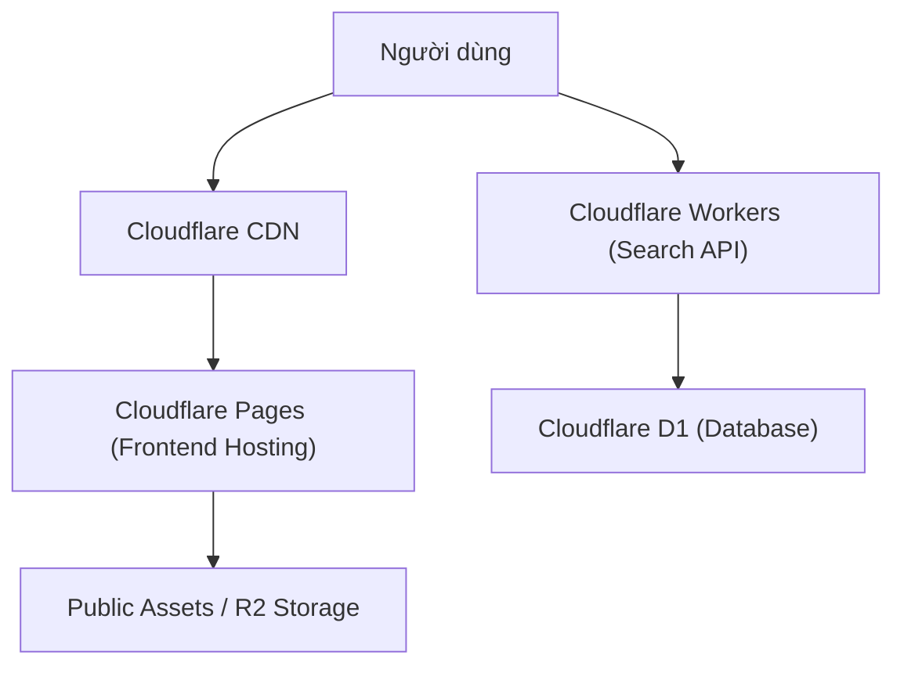

# System Design: Vietnam Canvas

## 1. Kiến trúc Hệ thống (Architecture)

Dự án sử dụng kiến trúc **JAMstack** kết hợp **Serverless**, triển khai hoàn toàn trên hạ tầng của Cloudflare.



## 2. Tech Stack

### 2.1. Frontend

- **Framework:** **Nuxt 3** (Vue 3 Composition API).
- **Modules:** `@nuxtjs/i18n`, `@nuxtjs/tailwindcss`, `@vueuse/nuxt`.
- **Deploy Mode:** SSG (Static Site Generation) - `nuxt generate`.
  - **Dynamic Routes Strategy:** Script `nitro.prerender.routes` sẽ chạy lúc build:
    1. Gọi API lấy danh sách tất cả `slug`.
    2. Duyệt qua từng `slug` và từng `locale` (vi, en, etc.).
    3. Sinh ra file HTML tĩnh cho mọi tổ hợp (VD: `/dia-diem/ha-long.html` VÀ `/en/destination/ha-long.html`).
- **Styling:** **Tailwind CSS** (v4 hoặc v3 latest).
- **Icons:** \*\*Lucide Vue`.
- **Animation:**
  - **GSAP (GreenSock):** Cho các hiệu ứng phức tạp (ScrollTrigger).
  - **CSS Keyframes:** Cho hiệu ứng đơn giản (Fade, Float).
- **i18n:** `@nuxtjs/i18n` (Strategy: Prefix ngoại trừ mặc định `vi`).

### 2.2. Backend & Database

- **Database:** **Cloudflare D1** (SQLite).
- **Search Engine:** **Cloudflare Workers**. (Xử lý tìm kiếm Full-text hoặc Like query trên D1, trả về JSON cho Frontend).
- **Storage:**
  - Giai đoạn 1: Lưu trực tiếp trong thư mục `public/` của Git repo.
  - Giai đoạn 2: Cloudflare R2 (Object Storage) cho Video/Ảnh chất lượng cao.

## 3. Thiết kế Cơ sở dữ liệu (Schema Design)

Sử dụng **SQLite** (D1). Bảng chính `destinations` kết hợp cột JSON để lưu cấu trúc nội dung linh động.

### Table: `destinations`

| Column        | Type        | Description                                       |
| :------------ | :---------- | :------------------------------------------------ |
| `id`          | INTEGER PK  | Auto increment ID                                 |
| `slug`        | TEXT        | Unique URL identifier (e.g., `vinh-ha-long`)      |
| `title`       | TEXT        | Destination Name                                  |
| `region`      | TEXT        | `north`, `central`, `south`                       |
| `category`    | TEXT        | `nature`, `culture`, `city`, `food`               |
| `short_desc`  | TEXT        | Short summary for cards/SEO                       |
| `thumbnail`   | TEXT        | URL to cover image                                |
| `detail_json` | TEXT (JSON) | Cấu trúc Scrollytelling & Metadata (Xem mẫu dưới) |
| `created_at`  | DATETIME    | Timestamp                                         |

### JSON Structure (`detail_json`)

```json
{
  "weather_icon": "cloud-sun",
  "best_time": "Tháng 4-6",
  "transport": "Xe khách, Máy bay",
  "story_sections": [
    {
      "type": "standard",
      "text": "Đoạn văn giới thiệu...",
      "image": "/images/a.jpg",
      "image_pos": "right"
    },
    {
      "type": "parallax",
      "text": "Đoạn văn cảm xúc...",
      "image": "/images/b.jpg"
    }
  ]
}
```

## 4. Giải pháp Đa ngôn ngữ (i18n)

- **Default (Tiếng Việt):** `/` (Không có prefix).
- **English:** `/en/...`.
- **Cấu hình:** `pages` sẽ được generate thành static HTML cho cả 2 ngôn ngữ để tối ưu SEO tốt nhất.
